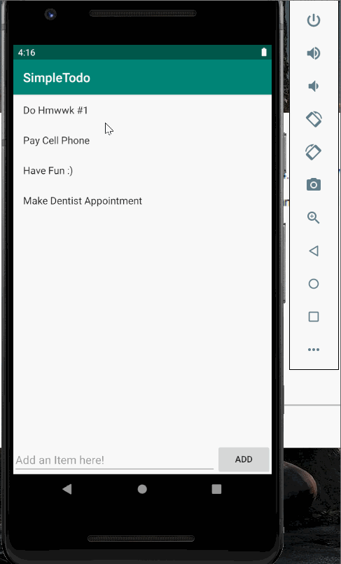

# Project 1 - Simple Todo

**Simple Todo** is an android app that allows building a todo list and basic todo items management functionality including adding new items, editing and deleting an existing item.

Submitted by: **Nancy Rosa**

Time spent: **5** hours spent in total

## User Stories

The following **required** functionality is completed:

* [x] User can **view a list of todo items**
* [x] User can **successfully add and remove items** from the todo list
* [x] User's **list of items persisted** upon modification and and retrieved properly on app restart

The following **optional** features are implemented:

* [x] User can **tap a todo item in the list and bring up an edit screen for the todo item** and then have any changes to the text reflected in the todo list

The following **additional** features are implemented:

* [ ] List anything else that you can get done to improve the app functionality!

## Video Walkthrough

Here's a walkthrough of implemented user stories:

GIF created with [LiceCap](http://www.cockos.com/licecap/).

## Notes

Describe any challenges encountered while building the app.

## License

    Copyright [yyyy] [name of copyright owner]

    Licensed under the Apache License, Version 2.0 (the "License");
    you may not use this file except in compliance with the License.
    You may obtain a copy of the License at

        http://www.apache.org/licenses/LICENSE-2.0

    Unless required by applicable law or agreed to in writing, software
    distributed under the License is distributed on an "AS IS" BASIS,
    WITHOUT WARRANTIES OR CONDITIONS OF ANY KIND, either express or implied.
    See the License for the specific language governing permissions and
    limitations under the License.

## Schema

### Models (For MVP->Minimal Viable Product)

User
|   Property   |  Type    |              Description                           |
|:------------:|:--------:|:--------------------------------------------------:|
| objectId     | String   | unique id for the user object(default)   	       |  
| FirstName    | String   | user first name                     	           |  
| LastName     | String   | user last name                      	           |    
| username     | String   | name used for user whilst using app   	           |
| password     | String   | used to create/login to account              	   |
| email        | String   | used to create/login to account               	   |
| hasPhoto     | boolean  | flag for verifying if user has a profile image     |  
| createdAt    | DateTime | date when user account was created(default)        |
| updatedAt    | DateTime | date when user account was last updated (default)  |

Post
|   Property      |          Type             |            Description                    |
|:---------------:|:-------------------------:|:-----------------------------------------:|
| objectId        | String                    | unique id for the Post object(default)    |  
| userPointer     | Pointer to User object    | identify creator of post                  |  
| fandomePointer  | Pointer to Fandome object | identify which fandome post belongs to    |  
| hasPhotos       | boolean                   | flag for verifying if post has photos     |    
| postDescription | String                    | text for post added by User               |
| createdAt       | DateTime                  | date when post was created(default)       |
| updatedAt       | DateTime                  | date when post was last updated (default) |

Photo
|   Property      |       Type                |            Description                    	   |
|:---------------:|:-------------------------:|:----------------------------------------------:|
| objectId        | String                    | unique id for the photo object   (default)     |  
| postPointer     | Pointer to Post object    | identify photo owner-if belonging to a Post    |
| fandomePointer  | Pointer to Fandome object | identify photo owner-if belonging to a Fandome |  
| userPointer     | Pointer to User object    | identify photo owner-if belonging to a User    |    
| photo           | File                      | image file                                	   |    
| title           | String                    | text description for photo                	   |
| createdAt       | DateTime                  | date when photo was created(default)       	   |
| updatedAt       | DateTime                  | date when photo was last updated (default) 	   |

Fandome
|   Property         |  Type    |          Description               			    |
|:------------------:|:--------:|:-------------------------------------------------:|
| objectId           | String   | unique id for the Fandome object(default)  		|  
| fandomeDescription | String   | text description of fandome                    	|  
| fandomeName        | String   | name of fandome                   				|    
| hasPhoto           | boolean  | flag for verifying if fandome has a profile image |  
| createdAt          | DateTime | date when fandome was created(default)            |
| updatedAt          | DateTime | date when fandome was last updated (default) 	    |

following
|      Property      |  Type                     |               Description              		  |
|:------------------:|:-------------------------:|:----------------------------------------------:|
| objectId           | String                    | unique id for the following object(default)    |  
| UserPointer        | Pointer to User object    | identify which user is the follower            |  
| FandomePointer     | Pointer to Fandome object | identify which fandome the user follows        |    
| createdAt          | DateTime                  | date when following was created(default)       |
| updatedAt          | DateTime                  | date when following was last updated (default) |

## Networking
### List of network request by screen (for MVP-> Minimal Viable Product)

* Login screen
    * (Read/GET) Query the logged in User object [hit 1 module User]
* Register Screen
    * (Create/Post) Create a new User object [hit 1 module User]
* Feed
    * (Read/GET) Query all the posts from Fandoms the user is following [hit 2 modules Following and Post]
* Creation
    * (Create/POST) Create a new post object [hit 1 module Post]
* User account
	* (Read/Get) Query all posts the User have created [hit 1 module post]
* Search
    * (Read/Get) Query all the matching Fandoms based off search criteria(fandome name) [hit 1 module Fandome]
* Fandom Hub Page
    * (Read/Get) Query the selected Fandom object [hit 1 module Fandome]
    * (Read/Get) Query all the post where belonging to the selected Fandome object [hit 1 module Post]

